# Todo App on Kubernetes — Project Flow & Working Documentation

> A React frontend, Node.js/Express backend, and MongoDB deployed on Minikube
> Kubernetes under the `demo-app` namespace.

---

## Table of Contents

1. [System Architecture](#1-system-architecture)
2. [Component Breakdown](#2-component-breakdown)
3. [Kubernetes Resource Map](#3-kubernetes-resource-map)
4. [Request Flow (End-to-End)](#4-request-flow-end-to-end)
5. [Deployment / Build Flow](#5-deployment--build-flow)
6. [Configuration & Secrets Flow](#6-configuration--secrets-flow)
7. [Health Check & Probe Flow](#7-health-check--probe-flow)
8. [Local Dev vs Cluster Comparison](#8-local-dev-vs-cluster-comparison)

---

## 1. System Architecture

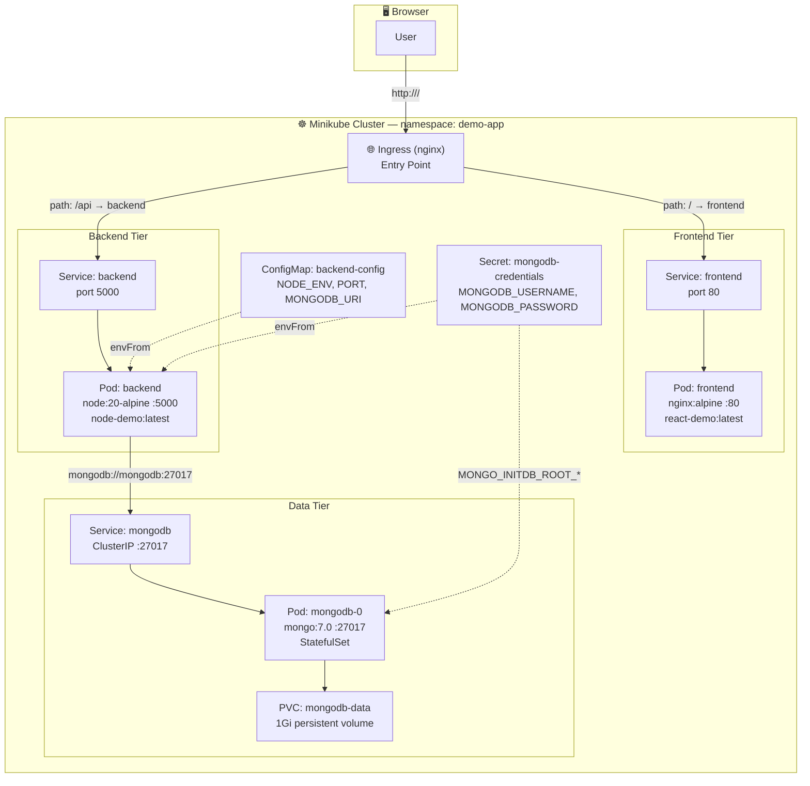

---

## 2. Component Breakdown

### 2.1 Frontend Component (`frontend/`)

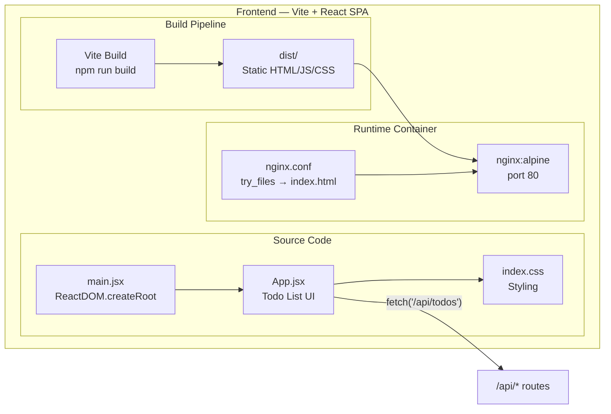

**Key responsibilities:**

| Component | Role |
|---|---|
| `main.jsx` | React entry point — mounts `<App />` into `#root` |
| `App.jsx` | Todo list UI — load, add, toggle, delete todos via relative `/api/*` URLs |
| `vite.config.js` | Dev proxy: `/api` → `http://localhost:5000` (local dev only) |
| `nginx.conf` | SPA fallback: `try_files $uri /index.html` |
| `Dockerfile` | Multi-stage: build with node → serve with nginx on port 80 |

### 2.2 Backend Component (`backend/`)

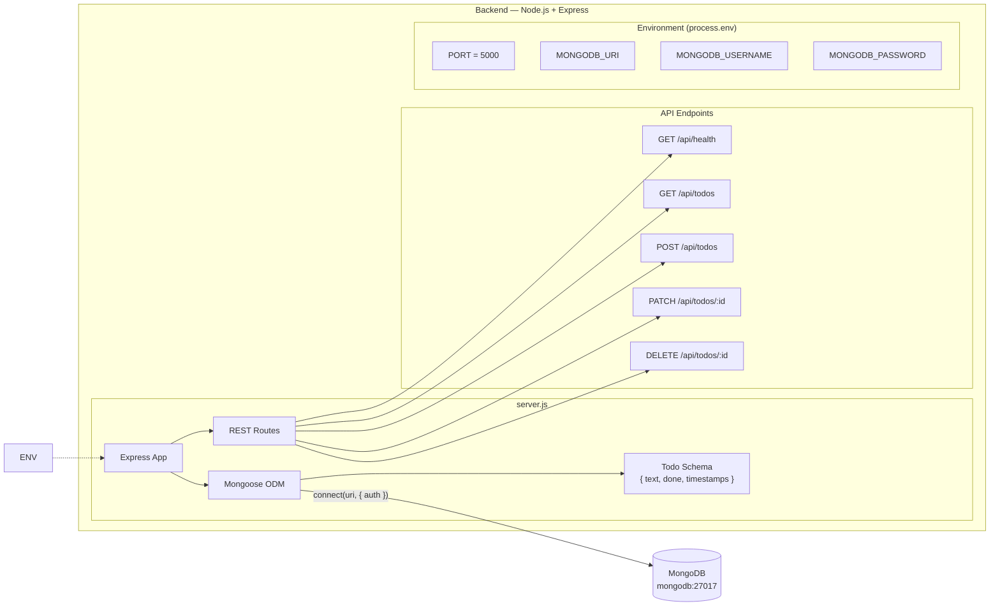

**API contract:**

| Method | Path | Purpose | Success | Error |
|---|---|---|---|---|
| GET | `/api/health` | Readiness/liveness probe | 200 | 503 |
| GET | `/api/todos` | List all todos (newest first) | 200 | — |
| POST | `/api/todos` | Create `{ text }` | 201 | 400 (empty text) |
| PATCH | `/api/todos/:id` | Update `text` / `done` | 200 | 404 |
| DELETE | `/api/todos/:id` | Delete a todo | 204 | 404 |

### 2.3 MongoDB Component (`k8s/mongodb.yaml`)

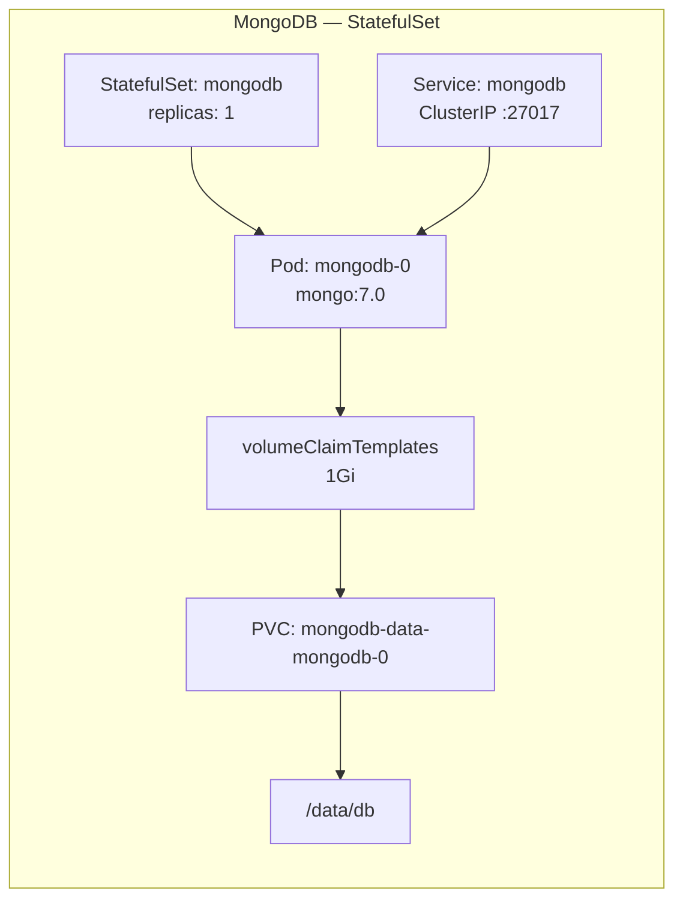

**Key characteristics:**

- **StatefulSet** (not Deployment) → stable pod name `mongodb-0` and stable PVC
- **Readiness probe** authenticates via `mongosh` (not just TCP check)
- **Liveness probe** uses TCP socket check
- **Root user** created on first boot from `mongodb-credentials` Secret

---

## 3. Kubernetes Resource Map

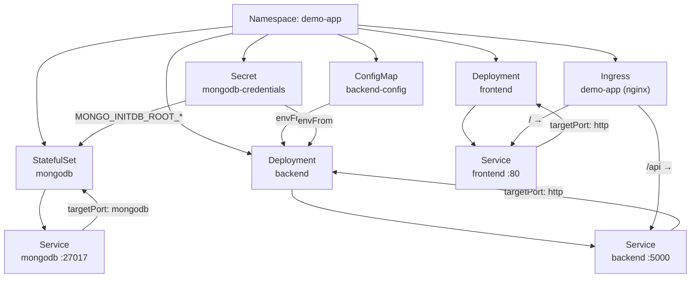

### Resource inventory

| Resource | Kind | Purpose |
|---|---|---|
| `demo-app` | Namespace | Isolates all workloads |
| `backend-config` | ConfigMap | Non-secret env: `NODE_ENV`, `PORT`, `MONGODB_URI` |
| `mongodb-credentials` | Secret | `MONGODB_USERNAME` / `MONGODB_PASSWORD` |
| `mongodb` | StatefulSet + Service | MongoDB 7.0 with 1Gi persistent storage |
| `backend` | Deployment + Service | Node.js API on port 5000 |
| `frontend` | Deployment + Service | nginx static server on port 80 |
| `demo-app` | Ingress | Path-based routing: `/api` → backend, `/` → frontend |

---

## 4. Request Flow (End-to-End)

### 4.1 Loading the page

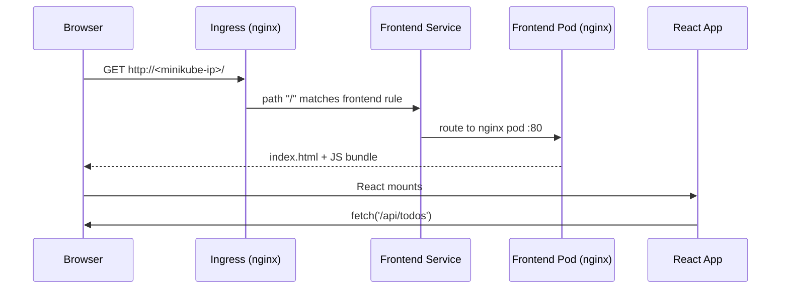

### 4.2 API call (GET /api/todos)

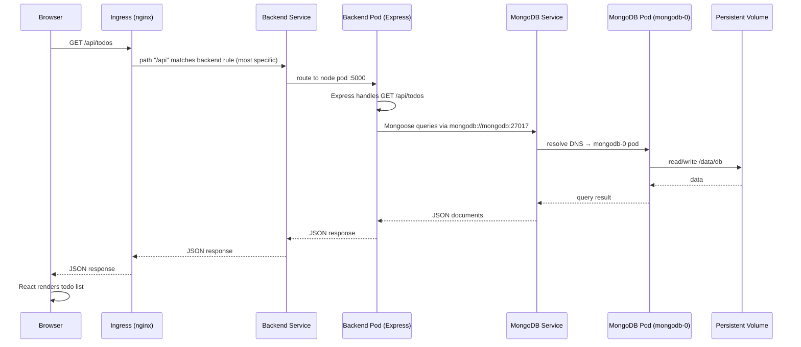

### 4.3 Add / Toggle / Delete operations

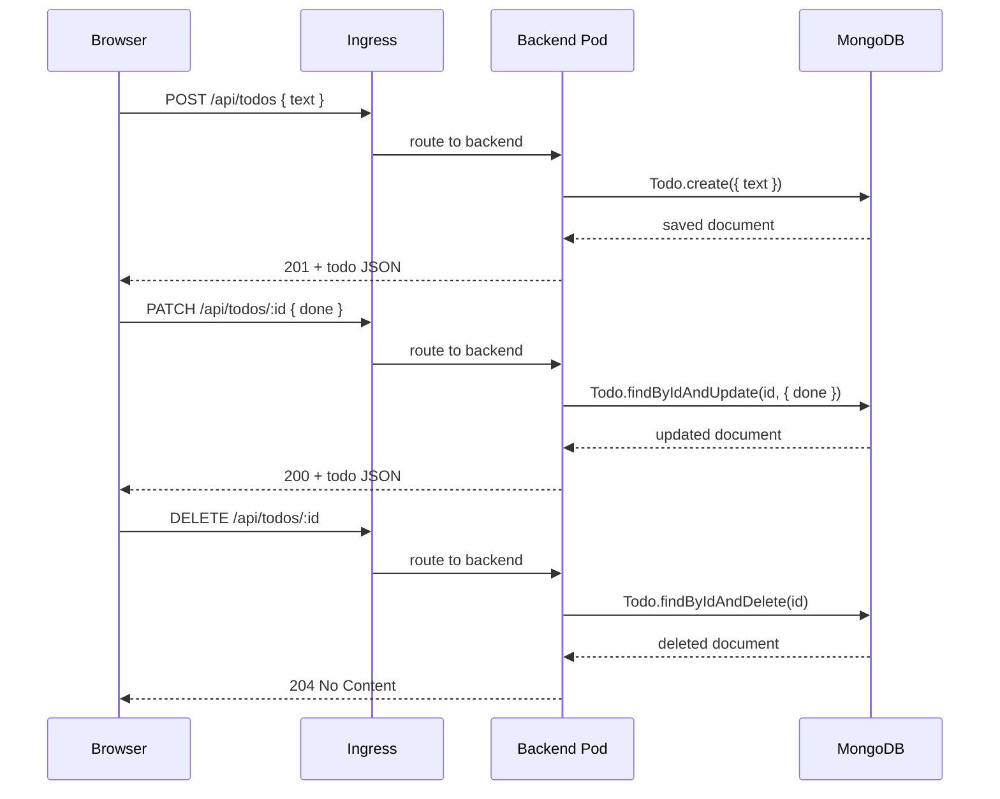

---

## 5. Deployment / Build Flow

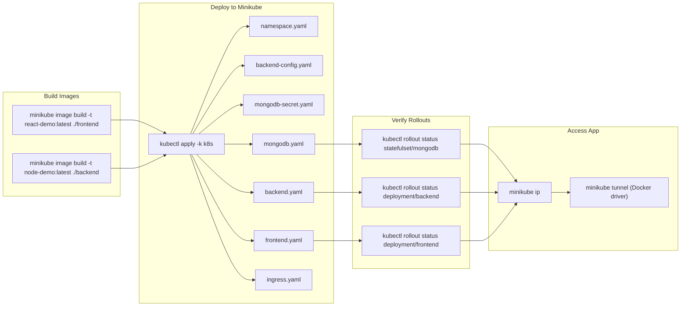

### Deployment order (kustomization)

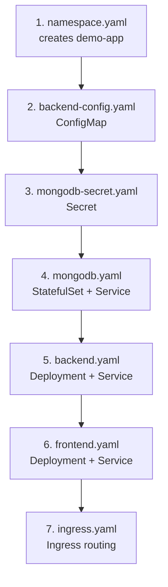

---

## 6. Configuration & Secrets Flow

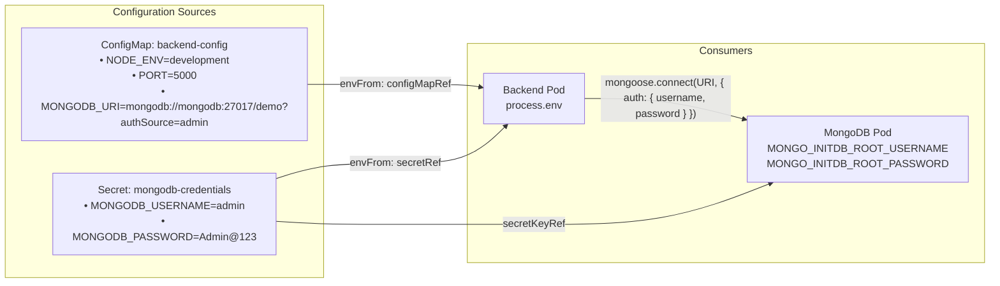

**Why split ConfigMap and Secret?**

- **ConfigMap** holds the connection *string* — non-sensitive, safe to view/commit
- **Secret** holds the *credentials* — base64-encoded at rest, consumed by both Mongo (root user creation) and backend (authentication)
- Password is never embedded in the connection string itself

---

## 7. Health Check & Probe Flow

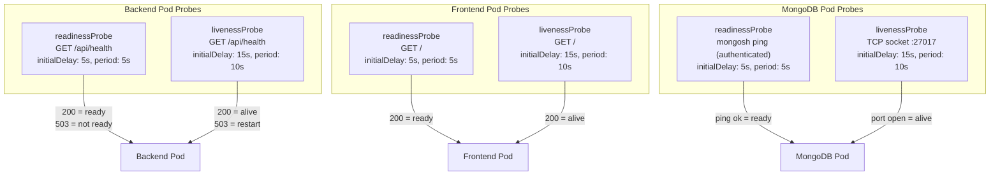

---

## 8. Local Dev vs Cluster Comparison

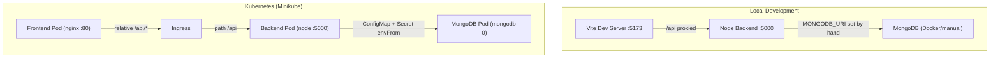

| Aspect | Local Dev | Kubernetes |
|---|---|---|
| Frontend calls `/api/*` | Vite proxy → `localhost:5000` | Ingress → `backend` Service |
| Backend Mongo connection | `MONGODB_URI` set manually | Injected via ConfigMap + Secret `envFrom` |
| Mongo | Run in Docker manually | StatefulSet + PVC, DNS name `mongodb` |
| Code branching | None — same code | None — only wiring changes |

---

## Quick Reference Commands

```bash
# Build images into Minikube
minikube image build -t react-demo:latest ./frontend
minikube image build -t node-demo:latest ./backend

#install ingress

minikube addons enable ingress

# Deploy everything
kubectl apply -k k8s

# Verify rollouts
kubectl rollout status statefulset/mongodb -n demo-app
kubectl rollout status deployment/backend -n demo-app
kubectl rollout status deployment/frontend -n demo-app

# Access
minikube ip
minikube tunnel   # only for Docker driver

# Inspect
kubectl get all,ingress,pvc -n demo-app
kubectl logs deployment/backend -n demo-app

# Cleanup
kubectl delete -k k8s